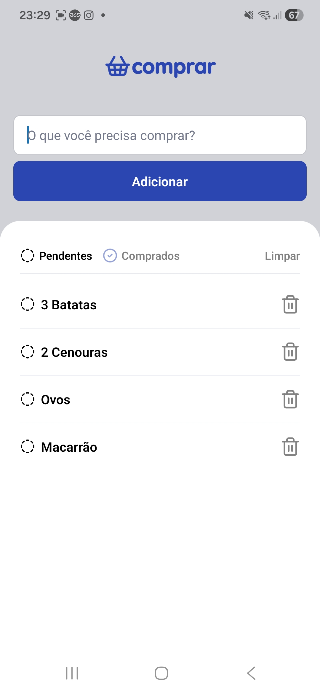

# Purchase

Aplicativo mobile de lista de compras desenvolvido com React Native e Expo Go com foco em aprendizado prático.

O objetivo deste projeto é estudar os fundamentos mais usados no dia a dia de aplicações mobile, colocando em prática conceitos de componentização, gerenciamento de estado, renderização de listas, persistência local e interação com o usuário.

## Objetivo do projeto

Este projeto foi criado com intuito de aprender React Native construindo uma aplicação simples, mas próxima de um cenário real. A proposta foi desenvolver uma lista de compras em que o usuário consegue adicionar itens, remover registros, limpar a lista e visualizar os itens por status.

Ao longo do desenvolvimento, o foco foi praticar recursos muito comuns em projetos mobile, especialmente aqueles usados em CRUDs simples e interfaces baseadas em lista.

## Preview



[Assista ao vídeo de demonstração](./assets/purchaseVideo.mp4)

## Funcionalidades

- Adição de itens à lista de compras
- Remoção individual de itens
- Limpeza completa da lista com confirmação
- Filtro por status: `pendentes` e `comprados`
- Persistência local dos dados com `AsyncStorage`
- Feedback visual e alertas para ações do usuário

## Principais conceitos praticados

### 1. Componentização

A interface foi separada em componentes reutilizáveis para deixar o código mais organizado e facilitar manutenção.

Componentes utilizados no projeto:

- `Button`
- `Input`
- `Filter`
- `Item`
- `StatusIcon`

Essa divisão ajuda a aplicar um dos princípios mais importantes do React Native: construir telas a partir de pequenas partes independentes e reaproveitáveis.

### 2. Gerenciamento de estado com `useState`

O estado da tela principal controla:

- o texto digitado no input
- o filtro ativo
- os itens exibidos na lista

Esse ponto foi importante para praticar atualização de interface em tempo real a partir das ações do usuário.

### 3. Efeitos com `useEffect`

O projeto usa `useEffect` para reagir à troca do filtro e recarregar os itens corretos na tela.

Esse padrão é muito comum em aplicações React Native quando a interface precisa responder a mudanças de estado, filtros, carregamentos ou sincronizações com dados externos.

### 4. Renderização de listas com `FlatList`

A exibição dos itens foi feita com `FlatList`, que é uma das abordagens mais importantes no React Native para trabalhar com listas de maneira mais performática.

No projeto, ela foi usada com:

- `data`
- `renderItem`
- `keyExtractor`
- `ItemSeparatorComponent`
- `ListEmptyComponent`

Isso ajuda a praticar o jeito mais comum de mostrar coleções de dados em apps mobile.

### 5. Persistência local com `AsyncStorage`

Os dados da lista são salvos localmente com `@react-native-async-storage/async-storage`.

Essa parte do projeto foi importante para aprender:

- leitura de dados salvos
- escrita de dados no armazenamento local
- remoção de registros
- limpeza completa da chave persistida

Esse tipo de persistência é muito útil em apps simples, protótipos e estudos que não precisam de backend.

### 6. Filtragem de dados por status

Os itens são organizados por status usando o enum `FilterStatus`, separando registros em:

- `pending`
- `done`

Esse mecanismo reforça um conceito muito usado em interfaces reais: manter uma fonte de dados e exibir subconjuntos dela de acordo com o filtro selecionado.

### 7. Alertas e interação com o usuário

O app usa `Alert` para:

- validar campos obrigatórios
- confirmar ações destrutivas
- informar erros
- mostrar feedback após operações

Essa é uma parte importante da experiência do usuário em apps mobile, especialmente em ações como exclusão e limpeza de dados.

## Estrutura do projeto

```text
src/
  app/
    Home/
  components/
    Button/
    Filter/
    Input/
    Item/
    StatusIcon/
  storage/
    itemsStorage.ts
  types/
    FilterStatus.ts
```

## Tecnologias utilizadas

- React Native
- Expo Go
- TypeScript
- AsyncStorage
- Lucide React Native

## Aprendizados colocados em prática

Durante a construção deste projeto, foram praticados conceitos essenciais para desenvolvimento mobile com React Native:

- criação de telas e componentes reutilizáveis
- passagem de propriedades entre componentes
- tipagem com TypeScript
- manipulação de listas
- atualização de estado
- persistência local de dados
- separação de responsabilidades entre UI, tipos e armazenamento

## Como executar o projeto

```bash
npm install
npm start
```

Depois, use o Expo Go para abrir o projeto no dispositivo físico ou rode em um emulador a partir do ambiente Expo.


## Sobre este projeto

Este projeto representa meu processo de aprendizado em React Native, com foco em entender as mecânicas mais utilizadas no desenvolvimento de aplicativos mobile. Mesmo sendo um app simples, ele reúne conceitos muito importantes para a base de qualquer aplicação.
